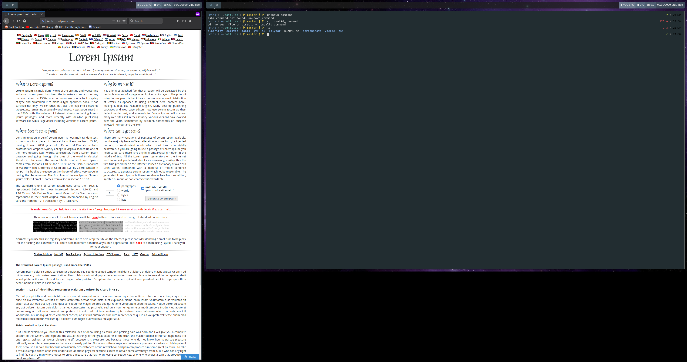

# Jubast's GNU/Linux Dotfiles

## Used Programs
- [i3-gaps](https://github.com/Airblader/i3) (window manager)
- [picom](https://github.com/yshui/picom) (X11 compositor)
- [polybar](https://github.com/polybar/polybar) (status bar)
- [alacritty](https://github.com/jwilm/alacritty) (terminal emulator)
- [zsh](https://sourceforge.net/projects/zsh/) (shell)
- [powerlevel9k](https://github.com/Powerlevel9k/powerlevel9k) (zsh theme)

## Used Fonts
- [NerdFonts](https://github.com/ryanoasis/nerd-fonts) (font for terminal)
- NotoMono (font for window manager)
- NotoSans (font for gtk applications)
- [FontAwesome](https://github.com/FortAwesome/Font-Awesome) (font for window manager)
- [JetbrainsMono](https://www.jetbrains.com/lp/mono/) (font for vscode)

## How to:
These dotfiles are prepared to be installed using GNU stow.   
```bash
cd ~
git clone https://github.com/Jubast/dotfiles
cd dotfiles
stow alacritty compton fonts gtk i3 polybar vscode wallpapers zsh rofi
```

## Screenshots
